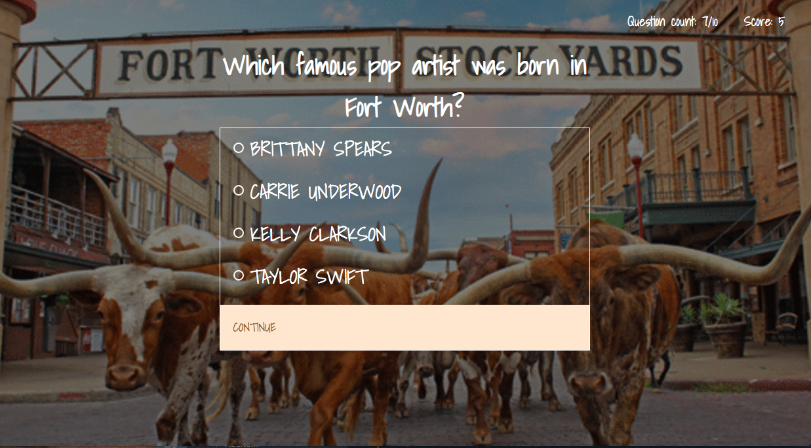

# quiz-app

Summary:
A web app to test your knowledge on the city of Fort Worth. The app consists of a 10 questions quiz, filled with different facts about the city. You are able to keep track of your score as you go along, with your score count tracked in the top right corner of the app.

Preview App:
https://dhutchings3.github.io/quiz-app/

Technology Used:
 - Javascript
 - HTML
 - CSS
 - jQuery

Screenshots:

Landing Page:

Quiz Question Page:

Results Page:

